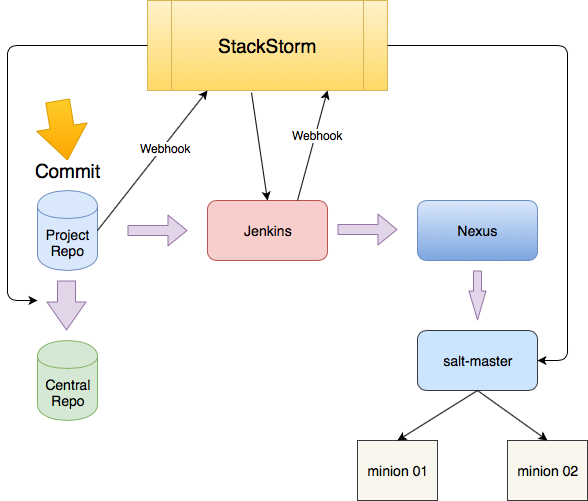

# StackStorm deployment pipeline example

Example of how to use Gitlab, Jenkins and SaltStack with StackStorm for deployment pipeline.

`Note: This is only example or starting point. To make it work you will need some level of knowladge to work with all tools in pipeline and finish some settings for pipeline.`

Repo include:  
+ Actions
+ Workflows
+ Rules
+ Webhooks
+ Sensors
+ Aliases

Example:

```yaml
---
description: Sync repositories and kick in Jenkins build for sample-app
enabled: true
runner_type: mistral-v2
entry_point: workflows/sample-app-build.yaml
name: sample-app-build
pack: myapp
```

#### How it works:

1. Changes are commited to project repos
2. After commit is called webhook which will sync project repo to comapny central Gitlab and start build job in Jenkins
3. When Jenkins finish build job, Saltstack will take artifacts from Nexus and deploy them to minions running Tomcat



### Extra

Repo also include:

Webhook which will refresh pillars on minions when sensor detect commit in pillar repo.

Alias for ChatOps to run workflow to reconfigure salt-master using saltmanage formula (Apply configs, clear locks, cache, refresh pillars and restart service)

---

### Maintainer
Simian Labs (www.simianlabs.io)  
sl@simianlabs.io

